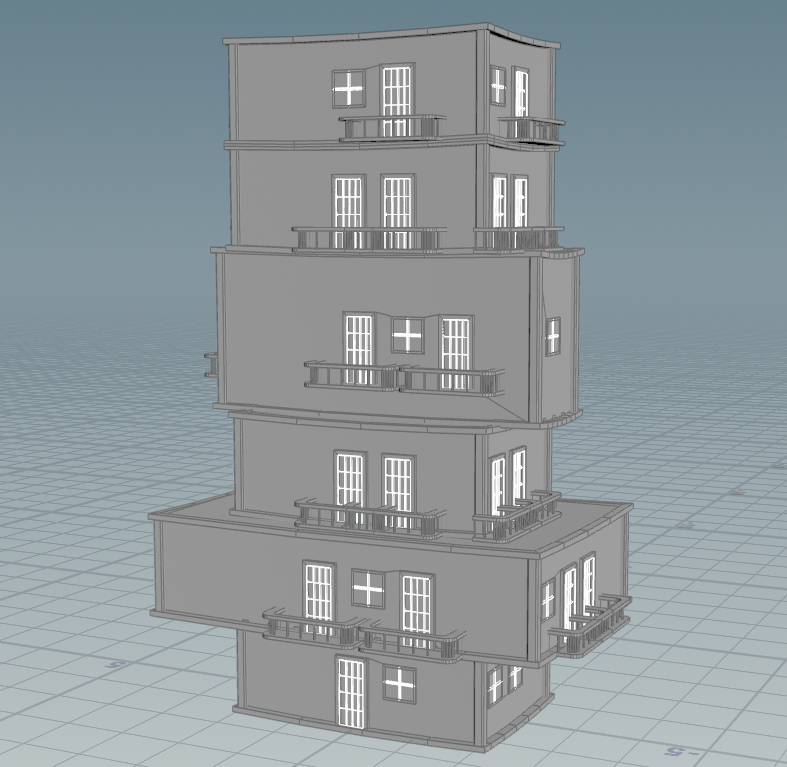
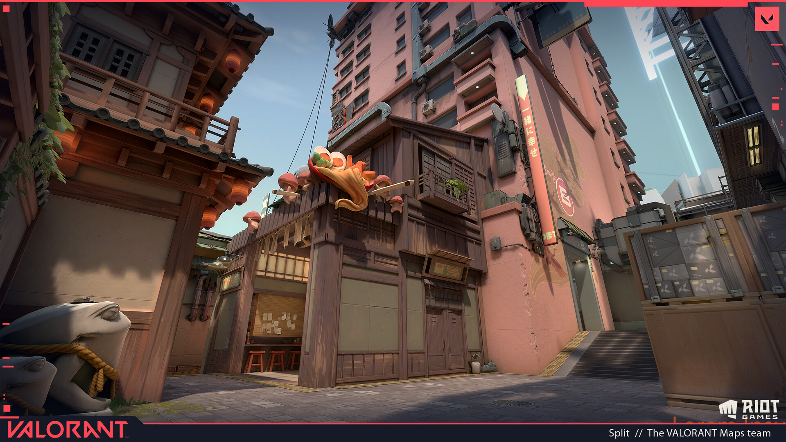
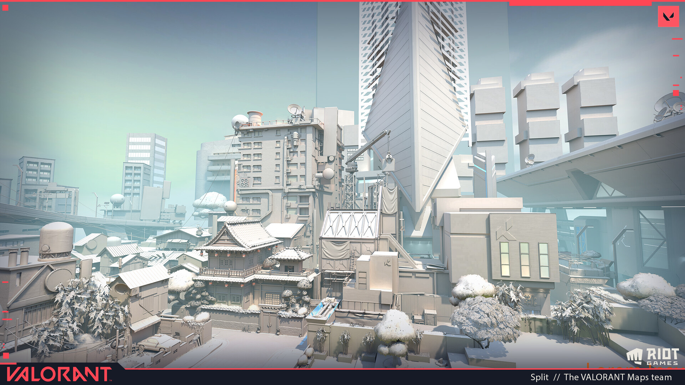
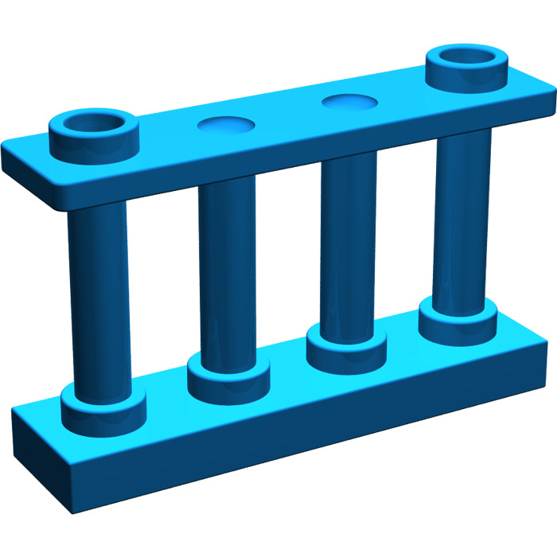

# CIS 5660 HW03 Procedural Buildings

## Submission Details (Charles Wang)

Video demo (if it's not playing it's also in the repo, called "demo.mp4"):

https://github.com/user-attachments/assets/e36efd02-ffa3-4b54-a5d0-ef57fe0b4a57

I was inspired partly by Asian architecture, mostly the way they construct their windows and doors. The [Behance Japanese-style cafe](https://www.behance.net/gallery/23773965/ISOBuilding-concept-art) was a good resource, as well as the following two images from Valorant:

As for the balcony, I was inspired by the Lego fence piece (kinda weird but it was the first thing I thought of):

My door, window, and balcony all share the same customization feature, which is being able to adjust the number of grid items/dense the details within the frame are. For the balcony it's the number of inner "posts" while the door and window can have their inner grid adjusted.
